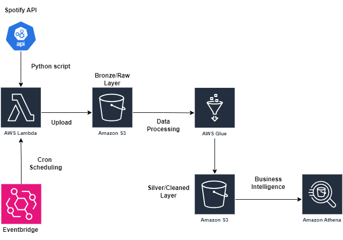

# Project Overview

The primary objective of this project is to analyze Spotify public data by building a fully automated serverless data pipeline using AWS services. This is a lightweight solution designed for cost-effectiveness and relatively low volumes of data.

Using a  Python script which is executed and scheduled using AWS Lambda + Eventbridge, the Spotify API is consumed and the resulting JSON responses are stored in an S3 bucket, this process is executed on a daily basis and separated directories are created per day, containing data about the 20 most followed artists in Spotify. Following a medallion architecture approach, an AWS Glue job is scheduled to run daily, exactly one hour after the raw data arrives on S3, which triggers a series of Pyspark transformations and writes the dataframe back to S3, representing the silver layer. Finally, Athena is used as the business intelligence layer where SQL queries are executed against a gold view with aggregations derived from the silver layer.

## Tech Stack
* Python: Consumption of the Spotify API , file uploads to S3
* Lambda + Eventbridge: Execution and daily scheduling of the Python script
* S3: Storage of raw unprocessed JSON data (bronze layer) and cleaned structured parquet tables (silver layer)
* Glue: Data processing transformations and writting data back to S3 (silver layer).
* Athena: Analytics and business intelligence.

## Architecture Diagram




## Business Intelligence Use Case Examples

Once the data has been stored and cleaned, Athena can be used to query using SQL the data on S3 and uncover analytical insights. 

### Who are the top 5 most followed Spotify artists as of today's date?

```

    SELECT 
        * 
    FROM 
        Spotify_Gold_View
    where
       CAST(date as DATE)=CURRENT_DATE
    ORDER BY 
        FOLLOWERS DESC
    LIMIT 5;

````

### Which artists are getting the highest increases in follower count per day?
```
    SELECT 
        name as Artist,
        CAST(avg(Followers_Gained) as INT) as AVG_DAILY_FOLLOWERS_GAINED 
    FROM 
        Spotify_Gold_View
    GROUP BY
        name
    ORDER BY
       AVG_DAILY_FOLLOWERS_GAINED DESC;

```
